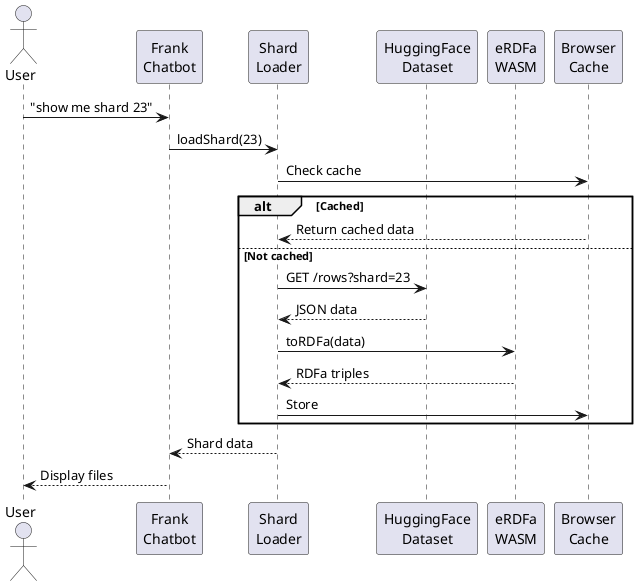
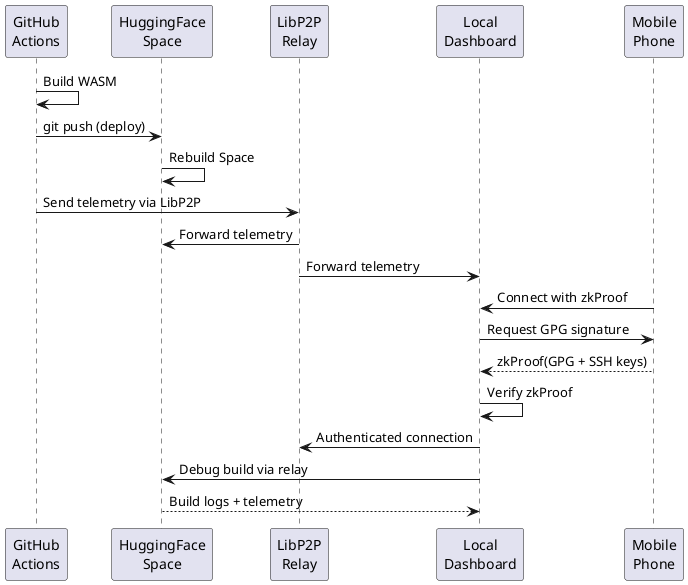
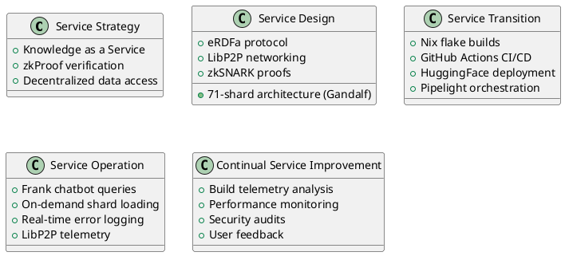
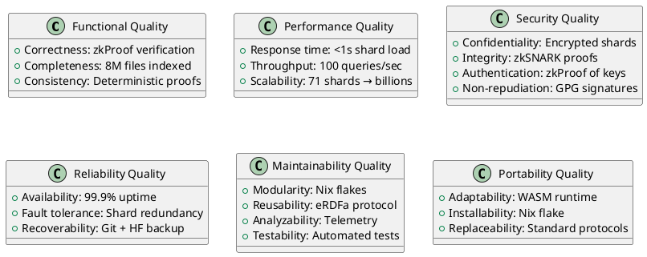
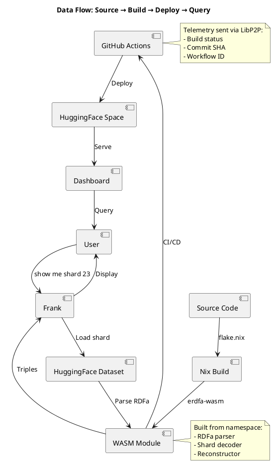
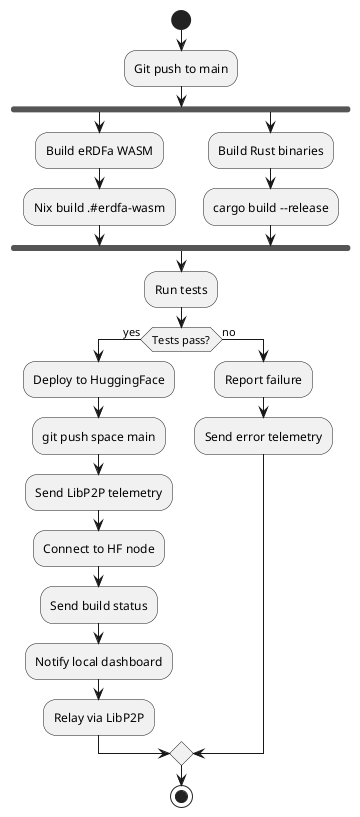

# zkPrologML System Architecture

## System Overview

zkPrologML is a distributed knowledge system with zero-knowledge proofs, combining:
- **Data Layer**: HuggingFace dataset (8M files, 71 shards)
- **Schema Layer**: eRDFa namespace (RDFa protocol)
- **Compute Layer**: Rust/WASM runtime
- **Network Layer**: LibP2P peer-to-peer
- **Security Layer**: zkSNARK proofs + GPG/SSH

## C4 Model

### Level 1: System Context

```plantuml
@startuml
!include https://raw.githubusercontent.com/plantuml-stdlib/C4-PlantUML/master/C4_Context.puml

Person(user, "User", "Developer/Researcher")
Person(mobile, "Mobile User", "Phone with GPG/SSH keys")

System(zkprologml, "zkPrologML", "Distributed knowledge system with zkProofs")

System_Ext(github, "GitHub", "Source code + CI/CD")
System_Ext(huggingface, "HuggingFace", "Dataset + Space hosting")
System_Ext(namespace, "eRDFa Namespace", "RDFa schema + WASM runtime")

Rel(user, zkprologml, "Queries via", "Frank chatbot")
Rel(mobile, zkprologml, "Authenticates via", "zkProof of GPG/SSH")
Rel(zkprologml, github, "Syncs from", "Git")
Rel(zkprologml, huggingface, "Loads data from", "Dataset API")
Rel(zkprologml, namespace, "Uses schema from", "Nix flake")
Rel(github, huggingface, "Deploys to", "GitHub Actions")

@enduml
```

### Level 2: Container Diagram

```plantuml
@startuml
!include https://raw.githubusercontent.com/plantuml-stdlib/C4-PlantUML/master/C4_Container.puml

Person(user, "User")
Person(mobile, "Mobile User")

System_Boundary(zkprologml, "zkPrologML") {
    Container(dashboard, "Dashboard", "HTML/JS", "Interactive UI with Frank chatbot")
    Container(erdfa_wasm, "eRDFa Runtime", "Rust/WASM", "RDFa parser + shard decoder")
    Container(libp2p_node, "LibP2P Node", "Rust", "P2P networking + telemetry")
    Container(zkproof_gen, "zkProof Generator", "Circom/Groth16", "Generate zkSNARK proofs")
    ContainerDb(shard_cache, "Shard Cache", "Browser Storage", "Cached shard data")
}

System_Ext(github, "GitHub")
System_Ext(hf_space, "HuggingFace Space")
System_Ext(hf_dataset, "HuggingFace Dataset")
System_Ext(namespace, "eRDFa Namespace")

Rel(user, dashboard, "Uses", "HTTPS")
Rel(mobile, libp2p_node, "Authenticates", "zkProof + GPG")
Rel(dashboard, erdfa_wasm, "Calls", "WASM API")
Rel(dashboard, hf_dataset, "Queries", "Dataset API")
Rel(erdfa_wasm, shard_cache, "Reads/Writes", "IndexedDB")
Rel(libp2p_node, hf_space, "Connects to", "LibP2P")
Rel(libp2p_node, github, "Receives telemetry from", "GitHub Actions")
Rel(github, hf_space, "Deploys to", "Git push")
Rel(erdfa_wasm, namespace, "Built from", "Nix flake")

@enduml
```

### Level 3: Component Diagram

```plantuml
@startuml
!include https://raw.githubusercontent.com/plantuml-stdlib/C4-PlantUML/master/C4_Component.puml

Container_Boundary(dashboard, "Dashboard") {
    Component(frank, "Frank Chatbot", "JavaScript", "Natural language query processor")
    Component(prolog_repl, "Prolog REPL", "Tau-Prolog", "Execute Prolog queries")
    Component(shard_loader, "Shard Loader", "JavaScript", "On-demand shard loading")
    Component(zkproof_modal, "zkProof Modal", "JavaScript", "Display zkSNARK proofs")
    Component(error_log, "Error Logger", "JavaScript", "Real-time error tracking")
}

Container_Boundary(erdfa_wasm, "eRDFa Runtime") {
    Component(rdfa_parser, "RDFa Parser", "Rust", "Parse RDFa triples")
    Component(shard_decoder, "Shard Decoder", "Rust", "Decode base64 shards")
    Component(reconstructor, "Reconstructor", "Rust", "Reconstruct from 71 shards")
}

Container_Boundary(libp2p_node, "LibP2P Node") {
    Component(peer_manager, "Peer Manager", "Rust", "Manage P2P connections")
    Component(telemetry_receiver, "Telemetry Receiver", "Rust", "Receive build telemetry")
    Component(zk_identity, "ZK Identity", "Rust", "Verify zkProofs of identity")
    Component(relay, "Relay", "Rust", "Relay messages between peers")
}

Rel(frank, shard_loader, "Requests shards")
Rel(shard_loader, rdfa_parser, "Parses RDFa")
Rel(rdfa_parser, shard_decoder, "Decodes shards")
Rel(peer_manager, telemetry_receiver, "Routes telemetry")
Rel(zk_identity, peer_manager, "Authenticates peers")

@enduml
```

## Sequence Diagram: Query Flow



## Sequence Diagram: GitHub → HuggingFace → Local



## ITIL Service Model



## Security Model

```plantuml
@startuml
!include https://raw.githubusercontent.com/plantuml-stdlib/C4-PlantUML/master/C4_Container.puml

title Security Architecture

rectangle "Authentication Layer" {
    [Mobile Phone] --> [zkProof Generator]: GPG + SSH keys
    [zkProof Generator] --> [ZK Identity Verifier]: Groth16 proof
}

rectangle "Authorization Layer" {
    [ZK Identity Verifier] --> [Access Control]: Verified identity
    [Access Control] --> [Shard Access]: Top-71 holders
}

rectangle "Data Layer" {
    [Shard Access] --> [Encrypted Shards]: 71 shards
    [Encrypted Shards] --> [Reconstructor]: All 71 required
}

rectangle "Network Layer" {
    [LibP2P Node] --> [TLS]: Encrypted transport
    [TLS] --> [Relay]: Secure relay
}

rectangle "Integrity Layer" {
    [zkSNARK Proofs] --> [Proof Verifier]: 585 proofs
    [Proof Verifier] --> [Data Integrity]: Verified
}

note right of [zkProof Generator]
    Zero-knowledge proof of:
    - GPG key ownership
    - SSH key ownership
    - No key material revealed
end note

note right of [Encrypted Shards]
    Gandalf threshold:
    - 71 shards total
    - All 71 required
    - Lattice-based encryption
    - Quantum-resistant
end note

@enduml
```

## Quality Model



## Deployment Diagram

```plantuml
@startuml
!include https://raw.githubusercontent.com/plantuml-stdlib/C4-PlantUML/master/C4_Deployment.puml

Deployment_Node(github, "GitHub", "Git + Actions") {
    Container(repo, "zkprologml", "Git repository")
    Container(actions, "CI/CD", "GitHub Actions")
}

Deployment_Node(hf, "HuggingFace", "Cloud") {
    Deployment_Node(space, "Space", "Static hosting") {
        Container(dashboard, "Dashboard", "HTML/JS/WASM")
    }
    Deployment_Node(dataset, "Dataset", "Parquet storage") {
        ContainerDb(parquet, "data.parquet", "8M rows, 250MB")
    }
}

Deployment_Node(namespace_gh, "GitHub", "Escaped-RDFa") {
    Container(namespace_repo, "namespace", "eRDFa spec + WASM")
}

Deployment_Node(local, "Local Machine", "Developer") {
    Container(local_dashboard, "Local Dashboard", "nginx")
    Container(libp2p_node, "LibP2P Node", "Rust daemon")
}

Deployment_Node(mobile, "Mobile Phone", "Android/iOS") {
    Container(gpg_app, "GPG App", "Key storage")
}

Rel(actions, space, "Deploys to", "Git push")
Rel(dashboard, parquet, "Queries", "HTTPS")
Rel(dashboard, namespace_repo, "Loads WASM from", "CDN")
Rel(libp2p_node, space, "Connects to", "LibP2P")
Rel(libp2p_node, actions, "Receives telemetry", "LibP2P")
Rel(gpg_app, libp2p_node, "Authenticates", "zkProof")

@enduml
```

## Data Flow Diagram



## Network Topology

```plantuml
@startuml
nwdiag {
  network internet {
      address = "0.0.0.0/0"
      
      github [address = "github.com"];
      hf_space [address = "hf.space"];
      hf_dataset [address = "datasets.hf.co"];
  }
  
  network libp2p {
      address = "libp2p/multiaddr"
      
      hf_node [address = "/dns4/hf.space/tcp/4001"];
      local_node [address = "/ip4/127.0.0.1/tcp/4001"];
      mobile_node [address = "/ip4/192.168.1.x/tcp/4001"];
      
      hf_node -- local_node [label = "relay"];
      local_node -- mobile_node [label = "zkProof auth"];
  }
  
  network local {
      address = "192.168.1.0/24"
      
      local_node [address = "192.168.1.100"];
      mobile_node [address = "192.168.1.101"];
  }
}
@enduml
```

## Build Pipeline


